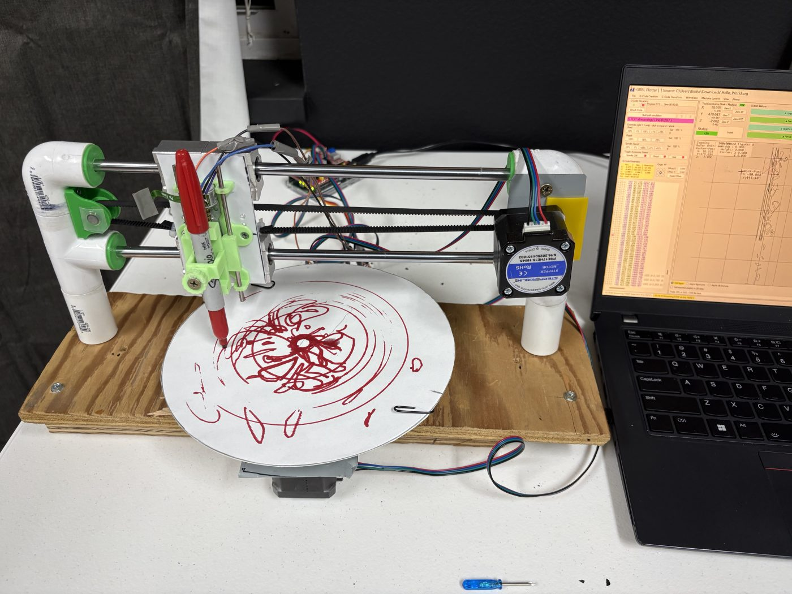
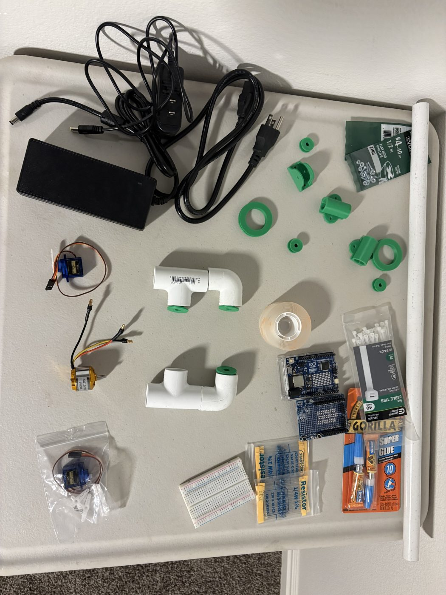
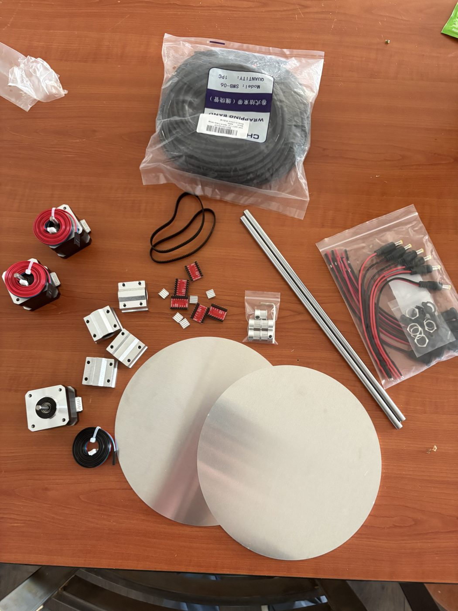
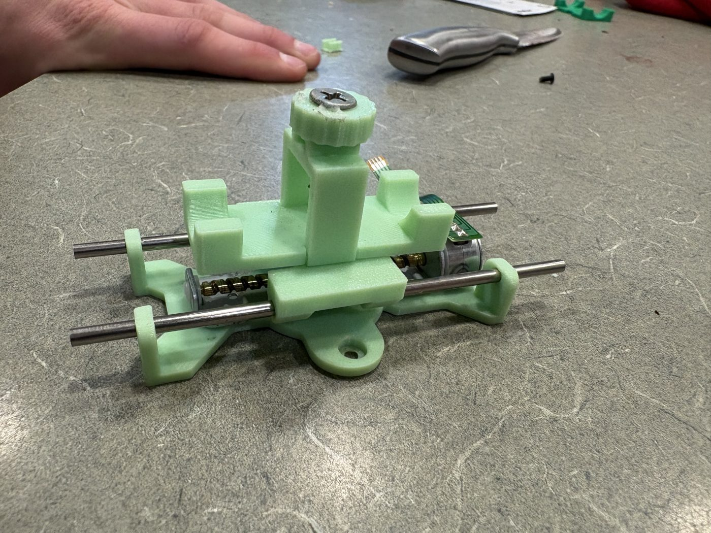
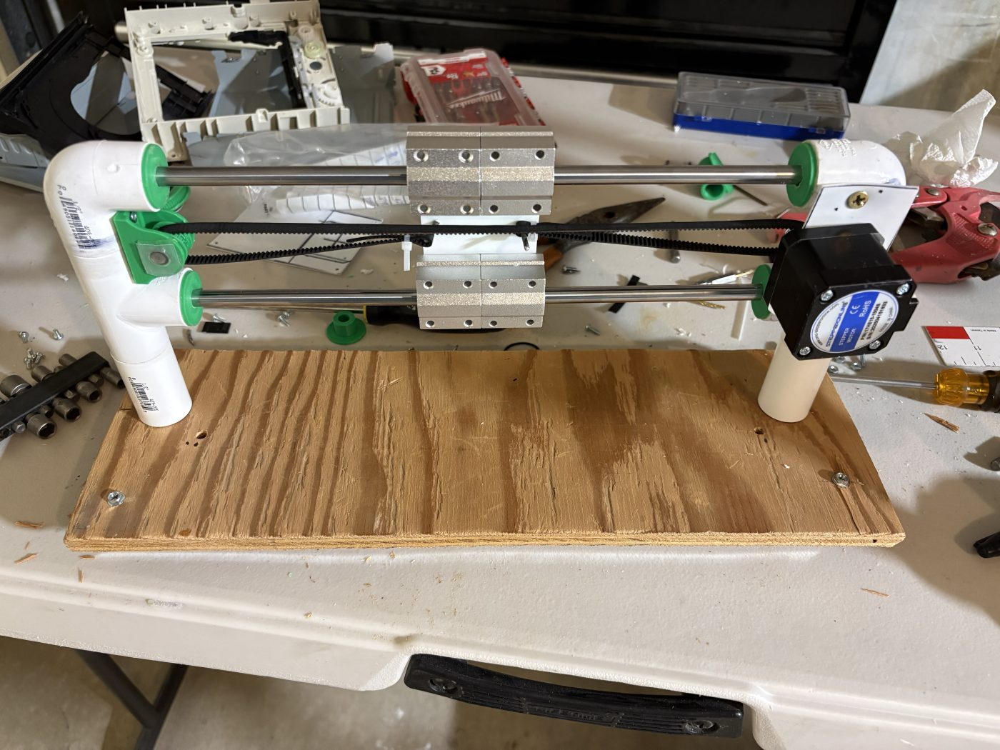
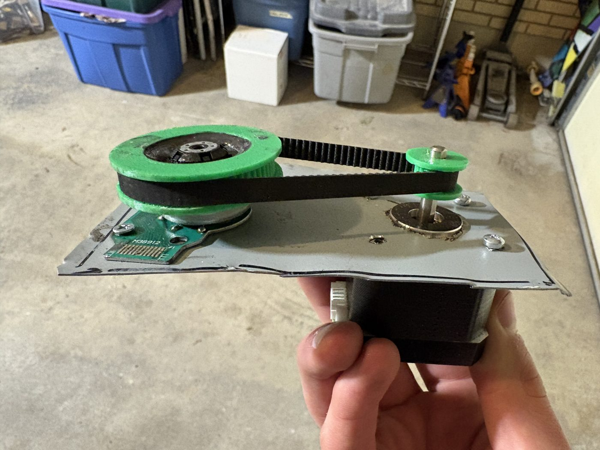

# Polar CNC Plotter

A pen plotter that works in **polar coordinates**: the pen slides along one straight axis while the paper spins underneath it. Built as my final project for ECE 1000 (Intro to Electrical & Computer Engineering) at Utah Valley University, Spring 2026.

**Status:** fully built, with all 3 axes moving and calibrated. Drawings didn't come out right with the Instructables software chain, so I'm building my own plotter app (see [Plotter app](#plotter-app)).

## How it works

A normal plotter moves the pen in X and Y. This one reaches every point on a round sheet with two motions instead:

| Axis | What moves | Driven by |
|---|---|---|
| Radius (r) | Pen carriage slides along two steel rods | Stepper motor + timing belt |
| Angle (θ) | Round aluminum platter spins | Stepper motor + belt from a small gear to a large gear (for torque and finer steps) |
| Pen (Z) | Pen lifts on and off the paper | Linear stepper salvaged from a DVD drive |

A point at (x, y) becomes r = √(x² + y²) and θ = atan2(y, x), so a picture has to be converted from Cartesian to polar G-code before the machine can draw it.

**Electronics:** Arduino + CNC Shield V3 with stepper drivers, running the open-source [GRBL](https://github.com/gnea/grbl) firmware.

**Software pipeline:**
1. **Inkscape**: trace the image into vector paths.
2. **GRBL-Plotter**: turn the paths into G-code and convert Cartesian to polar.
3. **Universal G-code Sender**: calibrate the axes and stream the G-code to the Arduino.

## Plotter app

**[Open the app](https://timothyhadfield.github.io/polar-cnc-plotter/)**: drop in an SVG or any picture (PNG, JPG, or paste one with Ctrl+V), see exactly what the pen will draw, download the polar G-code. Pictures are traced into pen lines automatically: outlines by default, or centerlines (one line down the middle of each stroke) in Settings.

**Why it exists:** GRBL-Plotter's "Convert to polar coordinates" decides when to add or subtract 360° from the *sign* of the angle, not from the *change* between two points. Whenever a stroke crosses certain lines through the center, the platter spins a full turn with the pen down and draws a stray ring. A port of that code ([tests/grblplotter-port.mjs](tests/grblplotter-port.mjs)) puts 2 full spins into a simple centered square.

**What the app does differently** ([js/polar.js](js/polar.js)):
- Takes the short way round between angles, so there are no stray spins.
- Splits every line until the machine's path stays within 0.1 mm of it. GRBL moves in a straight line in (radius, angle), which is a curve on the paper.
- Corrects for a pen line that misses the platter center (the "center gap" setting).
- Uses GRBL's inverse-time feed (G93), so the pen moves at a steady speed on the paper.
- Draws the preview *from the G-code it outputs*, so the preview shows what the machine will really do.

**Tests:** `node --test tests/*.test.mjs` runs 26 tests. Each shape and both sample drawings are simulated the way GRBL moves, and the tests check the pen never strays more than 0.1 mm from the intended lines. The same check fails on GRBL-Plotter's method.

**Machine check files** ([tests/machine/](tests/machine/)):
- `1-circle.nc`, `2-spoke.nc`: if the circle closes and the spoke is straight, the machine is fine.
- `3-square-grbl-plotter-method.nc` vs `4-square-fixed.nc`: the same square converted both ways.

Before running them: pen at the platter center, just touching the paper, then `G92 X0 Y0 Z0`. Pen up is Z2 and down is Z0 (change both in the app's settings).

Coming next: a Plot button that drives the plotter straight from the browser (Chrome/Edge over USB).

## Build

| | |
|---|---|
|  |  |
| **Materials:** 3D prints and hardware-store parts | Steppers, rods, belts, wiring and the platters |
|  |  |
| **Pen carriage:** 3D-printed holder on the DVD-drive linear stepper | **Radius axis:** PVC supports, steel rods, bearings, belt and motor |
|  |  |
| **Angle axis:** small gear drives a large one for mechanical advantage | **Assembled:** first test drawing (scrambled) |

What I did beyond the original design:
- **Salvaged a linear stepper** from a DVD drive for the pen axis, and got its four tiny leads connected to cables so it could plug into the CNC shield (the soldering was done with help).
- **Redesigned 3D-printed parts in CAD:** the pen holder and gears from the original were too small for the pen and belt I had, so I resized and reprinted them.
- **Swapped in different parts** where the Amazon parts didn't match the original build list.
- **Flashed GRBL, calibrated all 3 axes** in Universal G-code Sender and set up the Inkscape → GRBL-Plotter pipeline.

## Status

- ✅ Mechanical build, wiring, firmware and calibration of all 3 axes
- ✅ Image tracing and G-code generation
- ❌ **Drawing:** the plotter moves, but the image comes out unrecognizable. The most likely cause is the Cartesian-to-polar conversion step, which I haven't solved yet.
- Known build error: the platter's center sits a few millimeters off the pen's line of travel.

## What I'd change next time

- 3D-print the axis mounting plates instead of cutting and drilling scrap plastic by hand.
- Buy a linear stepper instead of salvaging one: it would have saved the extra prints, soldering and support rods.
- Use better parts on the CNC shield for smoother, quieter motion.

## Credits

- Mechanical design, wiring and firmware setup are based on **[Polar CNC Plotter V2 by Deepaksh123](https://www.instructables.com/Polar-CNC-Plotter-V2/)** on Instructables ([video](https://www.youtube.com/watch?v=GmB76t6MUKI)).
- Firmware: [GRBL](https://github.com/gnea/grbl) (MIT license). I didn't write any firmware; the Arduino runs stock GRBL.
- Tools: [Inkscape](https://inkscape.org/), [GRBL-Plotter](https://grbl-plotter.de/), [Universal G-code Sender](https://universalgcodesender.com/), [Arduino IDE](https://www.arduino.cc/en/software/). Polar conversion method from [this GRBL-Plotter tutorial](https://www.youtube.com/watch?v=juMho1eLXjo).

---
By [Timothy Hadfield](https://github.com/TimothyHadfield), Electrical Engineering @ UVU
